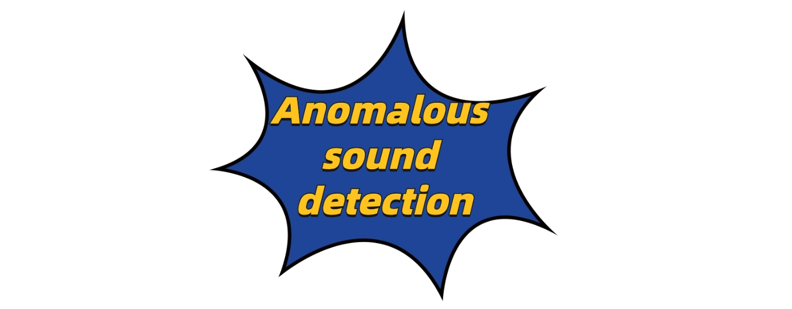

[](https://github.com/sindresorhus/awesome)
[](https://GitHub.com/Naereen/StrapDown.js/graphs/commit-activity)
[](http://makeapullrequest.com) 
[](https://arxiv.org/abs/2403.04279) 
[](https://visitor-badge.laobi.icu/badge?page_id=Chengyuann.Awesome-Anomalous-Sound-Detection-Methods)


## 🔖 News!!!

📌 We are actively tracking the latest research and welcome contributions to our repository and survey paper. If your studies are relevant, please feel free to contact us.

## 🎁 How to contribute to this repository?
Since the following content is generated based on our database, please provide the following information in the **issue** to help us fill in the database to add new papers (please do not submit a PR directly).
```text
1. Paper title
2. arXiv ID (if any)
3. Publication status (if any)
```

## Review and Count

|  Pub | Year      |Datasets                                                 | Note       |
| :--: | --------- | ------------------------------------------------------------ |---------- |
| ICASSP | 2020-2025   | DCASE2020 /DCASE2022        |           |
| TSALP | 2023、2025 |DCSASE |          |
| SPL | 2025 |DCSASE |          |
| Applied Acoustics | 2023  | DCASE |        |
| ArXiv   | ArXiv     | DCASE | ...|
| DCASE | 2020-2024 | DCASE |            |
| EUSIPCO| 2018、2021 | Sound Ideas Series 6000 General Sound Effects Library 、DCASE |            |
|ICCE| 2020 | MIMII  |            |
|Digital Signal Processing| 2023 | DCASE |            |


<details>
  <summary>🗂️ Table of Contents</summary>
  <ol>
    <li><a href="#papers">📝 Papers</a>
      <ul>
        <li><a href="#diffusion-models">Dual Models</a></li>
        <li><a href="#consistency-models">Generative Models</a></li>
      </ul>
    </li>
    <li><a href="#other-resources">🔗 Other Resources</a></li>
    <li><a href="#contributing">✍️ Contributing</a></li>
  </ol>
</details>

# 🗂️ dataset 

## DCASE20

Download the dataset from **[Audio dataset.](https://dcase.community/challenge2020/task-unsupervised-detection-of-anomalous-sounds)**

 
# 📝 Papers

## ICASSP

### Dual Models


 
1. **[SW-WAVENET: Learning Representation from Spectrogram and Wavegram Using Wavenet for Anomalous Sound Detection.](https://ieeexplore.ieee.org/document/10096742)**

    


    *H. Chen, L. Ran, X. Sun and C. Cai.* ICASSP'24. 🔥
  


1. **[NOISY-ARCMIX: ADDITIVE NOISY ANGULAR MARGIN LOSS COMBINED WITH MIXUP FOR ANOMALOUS SOUND DETECTION.](https://arxiv.org/pdf/2310.06364)** **[CODE.](https://github.com/soonhyeon/Noisy-ArcMix)**

    


   *Soonhyeon Choi, Jung-Woo Choi.* ICASSP'24. 🔥


1. **[A DUAL-PATH FRAMEWORK WITH FREQUENCY-AND-TIME EXCITED NETWORK FOR ANOMALOUS SOUND DETECTION.](https://ieeexplore.ieee.org/document/10448126)**

    


    *Yucong Zhang, Juan Liu, Yao Tian, Haifeng Liu, Ming Li.* ICASSP'24. 🔥

1. **[Hierarchical Metadata Information Constrained Self-Supervised Learning for Anomalous Sound Detection under Domain Shift.](https://ieeexplore.ieee.org/document/10446044)**

    


    *H. Lan, Q. Zhu, J. Guan, Y. Wei and W. Wang.* ICASSP'24. 🔥


1. **[DP-MAE: A Dual-Path Masked Autoencoder Based Self-Supervised Learning Method for Anomalous Sound Detection.](https://ieeexplore.ieee.org/document/10447859)**

    


    *Z. -L. Liu, Y. Song, X. -M. Zeng, L. -R. Dai and I. McLoughlin.* ICASSP'24. 🔥
   

1. **[Anomalous Sound Detection Using Audio Representation with Machine ID Based Contrastive Learning Pretraining.](https://arxiv.org/pdf/2304.03588v1)**

    


    *J. Guan, F. Xiao, Y. Liu, Q. Zhu and W. Wang.* ICASSP'23. 🔥


1. **[Anomalous Sound Detection Using Spectral-Temporal Information Fusion.](https://ieeexplore.ieee.org/document/9747868)**
*[code](https://github.com/liuyoude/STgram_MFN)*

    


    *Youde Liu; Jian Guan; Qiaoxi Zhu; Wenwu Wang.* ICASSP'22. 🔥
   
## Generative Models

1. **[UNSUPERVISED ANOMALY DETECTION AND LOCALIZATION OF MACHINE AUDIO: A GAN-BASED APPROACH.](https://arxiv.org/pdf/2303.17949)**
2. **[\[CODE\]](https://github.com/jianganbai/AEGAN-AD)**

    


    *A. Jiang, W. -Q. Zhang, Y. Deng, P. Fan and J. Liu.* ICASSP'23. 🔥


## GMM Models


1. **[Time-Weighted Frequency Domain Audio Representation with GMM Estimator for Anomalous Sound Detection.](https://ieeexplore.ieee.org/document/10096356)**

    


    *A. Jiang, W. -Q. Zhang, Y. Deng, P. Fan and J. Liu.* ICASSP'23. 🔥


### Other Models

1. **[Improvements of Discriminative Feature Space Training for Anomalous Sound Detection in Unlabeled Conditions.](https://ieeexplore.ieee.org/document/10890020)**


    *Takuya Fujimura et al.* ICASSP'25. 🔥

1. **[An Effective Anomalous Sound Detection Method Based on Representation Learning with Simulated Anomalies.](https://ieeexplore.ieee.org/document/10095398)**

    


    *H. Chen et al.* ICASSP'23. 🔥

1. **[Self-Supervised Representation Learning for Unsupervised Anomalous Sound Detection Under Domain Shift.](https://ieeexplore.ieee.org/document/9747863)**

    

    


    *H. Chen, Y. Song, L. -R. Dai, I. McLoughlin and L. Liu.* ICASSP'23. 🔥

1. **[Noise Supervised Contrastive Learning and Feature-Perturbed for Anomalous Sound Detection.](https://arxiv.org/abs/2509.13853)**


    


    *S. Huang, Z. Fang, L. and L. He.* ICASSP'25. 🔥
   
## SPL

1. **[ESTM: An Enhanced Dual-Branch Spectral-Temporal Mamba for Anomalous Sound Detection](https://ieeexplore.ieee.org/abstract/document/10329432)**

    

*C. Ma, P. Jia  and W. Yang.* SPL'25. 🔥

## TASLP

1. **[Why Do Angular Margin Losses Work Well for Semi-Supervised Anomalous Sound Detection?](https://ieeexplore.ieee.org/document/11152580)**

    


    *HK. Wilkinghoff and F. Kurth.* IEEE/ACM Transactions on Audio, Speech, and Language Processing 2023. 🔥

1. **[Why Do Angular Margin Losses Work Well for Semi-Supervised Anomalous Sound Detection?](https://ieeexplore.ieee.org/abstract/document/10329432)**

    


    *HK. Wilkinghoff and F. Kurth.* IEEE/ACM Transactions on Audio, Speech, and Language Processing 2023. 🔥


1. **[AdaProj: Adaptively Scaled Angular Margin Subspace Projections for Anomalous Sound Detection with Auxiliary Classification Tasks](https://arxiv.org/abs/2403.14179)**

    


    *Kevin Wilkinghoff.* DCASE 2024. 🔥


## Applied Acoustics
 
   1. **[Unsupervised anomalous sound detection for industrial monitoring based on ArcFace classifier and gaussian mixture model](https://www.sciencedirect.com/science/article/pii/S0003682X2200562X)**


  *Ji Wu ,Fei Yang .* Applied Acoustics Volume 203, 28 February 2023, 109188. 🔥


<p align="right" style="font-size: 14px; color: #555; margin-top: 20px;">
    <a href="#readme-top" style="text-decoration: none; color: #007bff; font-weight: bold;">
        ↑ Back to Top ↑
    </a>
</p>
